<h1 align="center"> Hi 👋, I'm Mohammed </h1>

<h3 align="center"> SWE @ iConcierge | Ex Intern @ Dell Technologies | Backend Developer | GDGoC HUN ’25 Lead | ICPC HUN Community Lead | CP Coach </h3>

I'm a backend-focused Software Engineer passionate about building scalable, maintainable systems and contributing to open source. My primary stack includes **TypeScript**, **C#**, **Java**, and **Python**, with experience in **NestJS**, **ASP.NET Core**, **Spring Boot**, **PostgreSQL**, **Redis**, and cloud platforms like **AWS** and **GCP**.

I'm particularly interested in **backend architecture**, **distributed systems**, **cloud-native applications**, and **developer tooling**, and I'm always looking for opportunities to learn through real-world projects and open-source contributions.

- 🚀 Building backend services with **NestJS** & **ASP.NET Core**
- 🌱 Exploring **Cloud-native patterns** & **Event-driven systems**
- 🤝 Open to collaborating on backend and open-source projects

---

## 💻 Tech Stack:

---

### 📊 GitHub Stats

